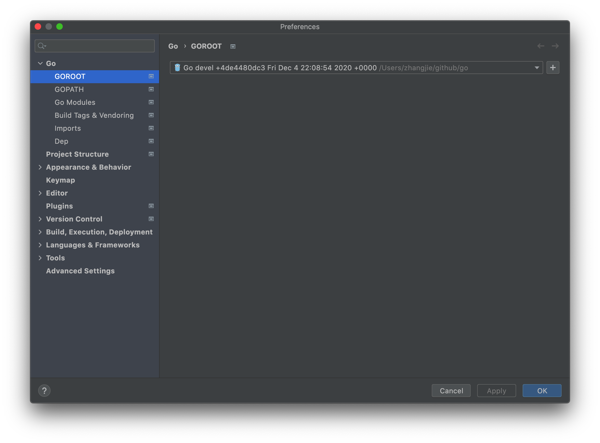

# 准备

在深入学习go语言设计实现过程中，少不了要去阅读些源码，有时还要修改源码并测试，因此掌握基本的go语言开发设置是有必要的，这样会让我们的学习过程事半功倍。

> **QA: 为什么要读源码？**
> 我们可以看别人画图并伴有系统性总结的文章、书籍，但要知道从源码翻译成图解是个技术活，从图解实现成源码也是一个技术活，学习go设计实现相当于我们在既有的工程中学习，有些东西别人未必会尝试将其翻译成图解。如果一味寄希望于接收别人咀嚼过的东西，久而久之，会削弱自己独立寻求答案的能力。
> 本书参考他人的总结，是为了追求更快、更全面的知识覆盖，我们在学习过程中还是要脚踏实地一点，看完别人总结后，可以去翻翻源码求证下。
> 如果是对编程语言设计实现有深厚的积累的同学，那就另当别论了。

# 环境设置

## 安装必要工具

### 安装git

比如macOS下可以通过homebrew安装，brew install git

### 安装go

一般go开发人员已经安装过go语言支持组件了，没有的话下载最新版安装即可

> 这里的安装设置力求简单，实际上从源码构建go，使用go1.4（最后一个c语言实现的编译器版本）及其之后的go编译器版本均可以，我们这里就直接用最新版好了。

## 从源码构建
### 下载源码

```bash
#新建目录用于存放go源码，不与GOROOT混在一起即可
mkdir path/to/goroot
#检出源代码
git clone https://github.com/golang/go path/to/goroot
```

### 执行构建

```bash
#从源码执行构建
cd path/to/goroot
cd src && all.bash
```
构建出的可执行程序会存放在path/to/goroot/bin下面，如果想测试可以通过`path/to/goroot/bin/go build`来对go源码进行编译。

### 修改源码

当我们希望修改源码并进行测试，也需要按照上述过程对path/to/goroot/bin/go进行重新构建，然后再对go源码进行编译、测试。

## IDE如何设置

如果想方便地阅读源码，设置好IDE是必须的。对于go源码，如果我们直接打开该工程并阅读源码，IDE会提示遇到些错误。最常见的一个错误就是“use of internal package not allowed”，当我们打开源码文件，如果该源码文件import了标准库中internal路径下的包，就会遇到这个错误。

### 说下IDE报错的原因

对于importpath internal在go中是有特殊意义的，它限定了其下的packages只能在与internal同级目录下及其子目录下packages引用，go源码中的package引用也遵循这个规则，当我们的GOROOT环境变量设置指向的不是当前检出的go工程目录时，go编译器会认为其import的标准库应该要从GOROOT（比如/usr/local/go/src）下去引用，此时就会认为引用了不被允许的internal package。

### 为何all.bash不报错

因为all.bash执行的脚本里面对GOROOT进行了正确的设置，编译时才没有报错。

### 如何解决这个问题呢

IDE里面需要正确设置GOROOT，让其指向新检出的源码目录即可解决。搞定了这个就可以在IDE里正常阅读，并执行单测。以GoLand为例，打开Preferences->Go->GOROOT，添加新检出的go源码位置作为新的Go SDK路径，点击保存即可。



# References
1. https://go.dev/doc/install/source
